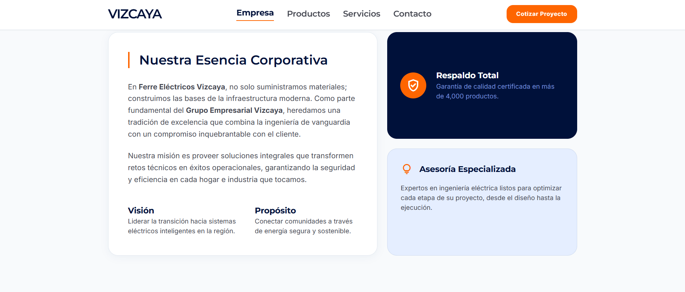
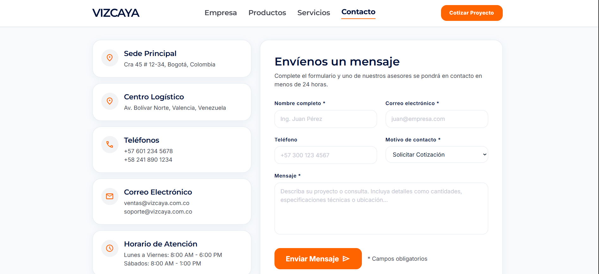
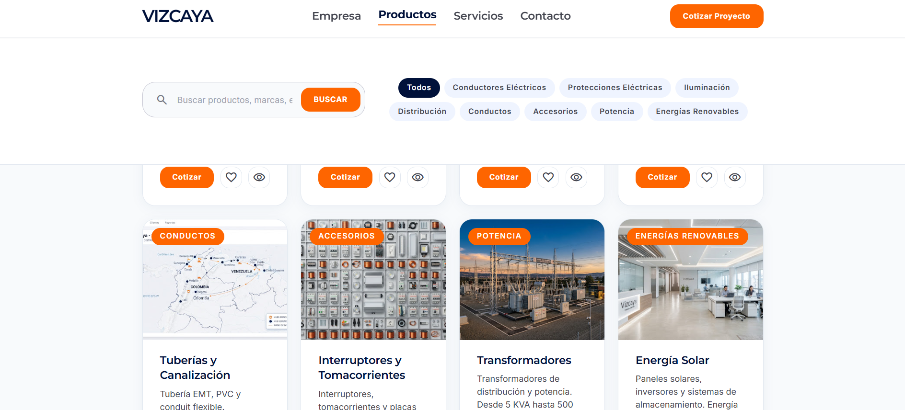
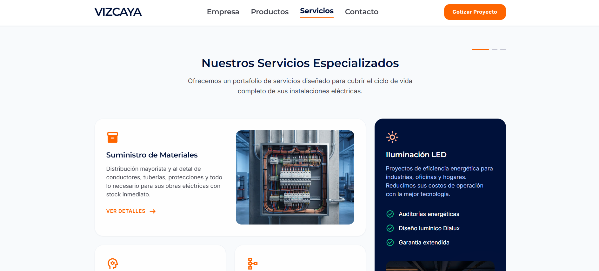

# ⚡ Ferre Eléctricos Vizcaya

**Aplicación web corporativa para una empresa líder en suministros eléctricos e ingeniería industrial.**


---

## 🖼️ Capturas de Pantalla

| Home | Servicios |
|------|-----------|
|  |  |

| Productos | Contacto |
|-----------|----------|
|  |  |

---

## 🚀 Demo en vivo

```bash
npm run dev
# → http://localhost:5173
```

---

## 📁 Estructura del Proyecto

```
src/
├── data/                       # 🆕 Capa de datos desacoplada
│   ├── siteConfig.js           # Configuración global (nombre, navegación, footer)
│   ├── home.js                 # Datos de página Empresa
│   ├── servicios.js            # Datos de página Servicios
│   ├── productos.js            # Datos de página Productos
│   └── contacto.js             # Datos de página Contacto
│
├── components/
│   ├── ui/                     # 🧩 Componentes atómicos reutilizables
│   │   ├── Button.jsx          # 4 variantes × 4 tamaños + icono
│   │   ├── Badge.jsx           # 3 variantes: default, solid, outline
│   │   ├── Card.jsx            # 4 variantes: default, glass, dark, tinted
│   │   ├── IconBox.jsx         # Contenedor circular de ícono
│   │   ├── SectionHeader.jsx   # Título + descripción centrados
│   │   └── ScrollReveal.jsx    # Animación de entrada con IntersectionObserver
│   │
│   └── layout/                 # 📐 Componentes estructurales
│       ├── Navbar.jsx          # Navegación responsive + menú móvil
│       ├── Footer.jsx          # Footer con newsletter accesible
│       ├── HeroSection.jsx     # Hero reutilizable para las 4 páginas
│       └── Section.jsx         # Wrapper de sección (padding, bg, reveal)
│
├── pages/
│   ├── HomePage.jsx            # / — Empresa: misión, stats, proyectos, CTA
│   ├── ServiciosPage.jsx       # /servicios — Bento grid de 4 servicios
│   ├── ProductosPage.jsx       # /productos — Catálogo con búsqueda y filtros
│   └── ContactoPage.jsx        # /contacto — Formulario + FAQs acordeón
│
├── App.jsx                     # React Router v6
└── main.jsx                    # Entry point
```

---

## 🎨 Design System

Implementado desde los tokens de diseño de **Google Stitch**:

| Categoría | Especificaciones |
|-----------|-----------------|
| **Paleta** | Navy `#00113a`, Orange `#fe6500`, Slate technical grays |
| **Tipografía** | Montserrat (headings) + Inter (body/captions) |
| **Elevación** | 3 niveles con sombras tintadas en navy |
| **Bordes** | 8px estándar, 16px cards, pill full |
| **Grid** | 12 columnas, gutter 24px, max-width 1280px |
| **Breakpoints** | Mobile < 768px, Tablet 768-1279px, Desktop 1280px+ |

---

## ✨ Características Principales

- ⚛️ **React 18** con Vite 5 — HMR ultrarrápido
- 🎨 **Design System completo** con tokens en `tailwind.config.js`
- 📊 **Separación de preocupaciones** — Datos, UI, Layout, Páginas bien separados
- 🔍 **Búsqueda + filtros** en tiempo real en la página de Productos
- 📝 **Formulario de contacto** con validación HTML5 nativa
- 🎬 **Animaciones de scroll reveal** con `IntersectionObserver` y cleanup
- ♿ **Accesibilidad**: labels semánticos, `aria-expanded`, `focus-visible`
- 📱 **Responsive**: mobile-first con menú hamburger
- 🏷️ **Badges, Cards y Buttons** como componentes reutilizables

---

## 🛠️ Tecnologías

| Herramienta | Uso |
|-------------|-----|
| [React 18](https://react.dev/) | UI declarativa |
| [Vite 5](https://vitejs.dev/) | Build tool ultrarrápido |
| [Tailwind CSS 3](https://tailwindcss.com/) | Utilidades CSS + design tokens |
| [React Router 6](https://reactrouter.com/) | Navegación SPA |
| [Material Symbols](https://fonts.google.com/icons) | Iconografía |
| [Google Fonts](https://fonts.google.com/) | Montserrat + Inter |

---

## 🚦 Cómo ejecutar

```bash
# 1. Clonar
git clone https://github.com/TU_USUARIO/ferre-electricos-vizcaya.git
cd ferre-electricos-vizcaya

# 2. Instalar dependencias
npm install

# 3. Iniciar servidor de desarrollo
npm run dev

# 4. Build de producción
npm run build
npm run preview
```

---

## 📄 Páginas

| Ruta | Descripción |
|------|-------------|
| `/` | **Empresa** — Hero, misión/visión, estadísticas (25+ años, 4k+ productos), galería de proyectos, CTA |
| `/servicios` | **Servicios** — Hero, bento grid (suministro, iluminación LED, asesoría, proyectos), catálogo, marcas partner, distribución regional |
| `/productos` | **Productos** — Hero, barra de búsqueda, filtros por 9 categorías, grid responsivo de 8 productos con fallback de imagen, CTA |
| `/contacto` | **Contacto** — Hero, 5 tarjetas de info, formulario completo con select de motivo, FAQs acordeón, CTA de visita |

---

## 👤 Autor

Desarrollado como proyecto demo de portafolio — [Tu nombre / GitHub]

---

## 📝 Licencia

MIT — Libre para usar, modificar y compartir.
